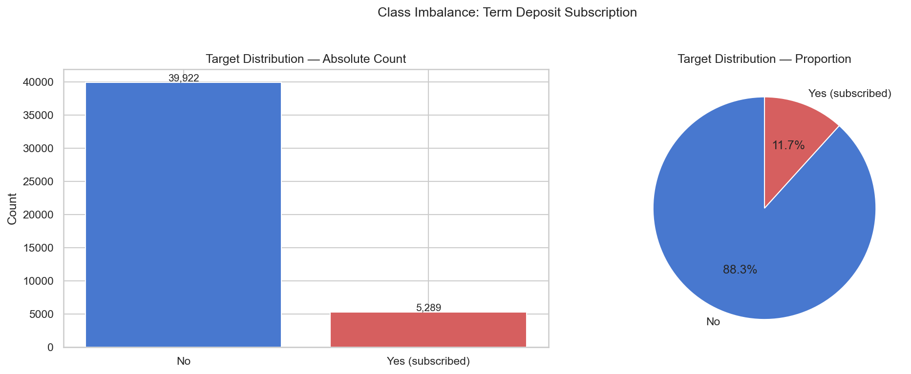
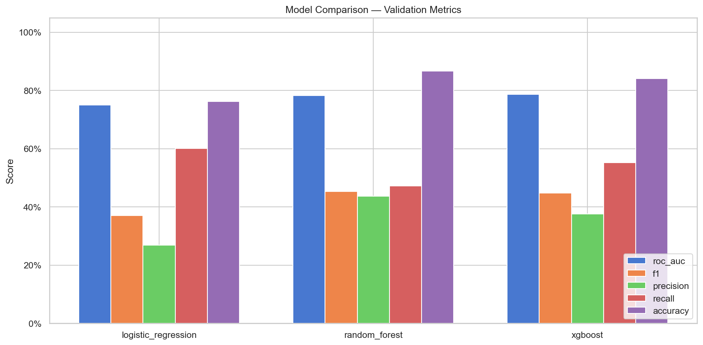
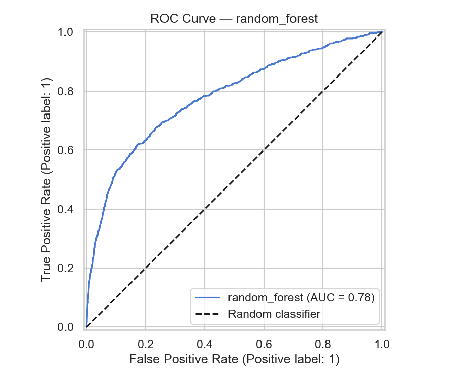
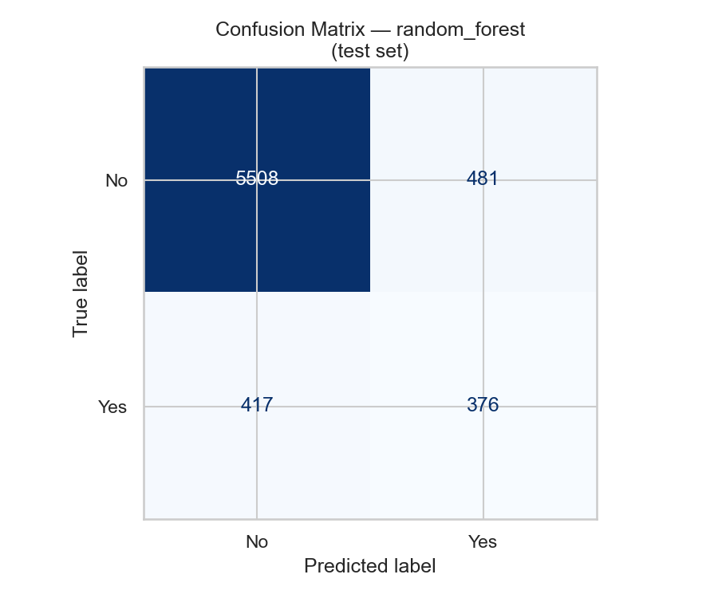
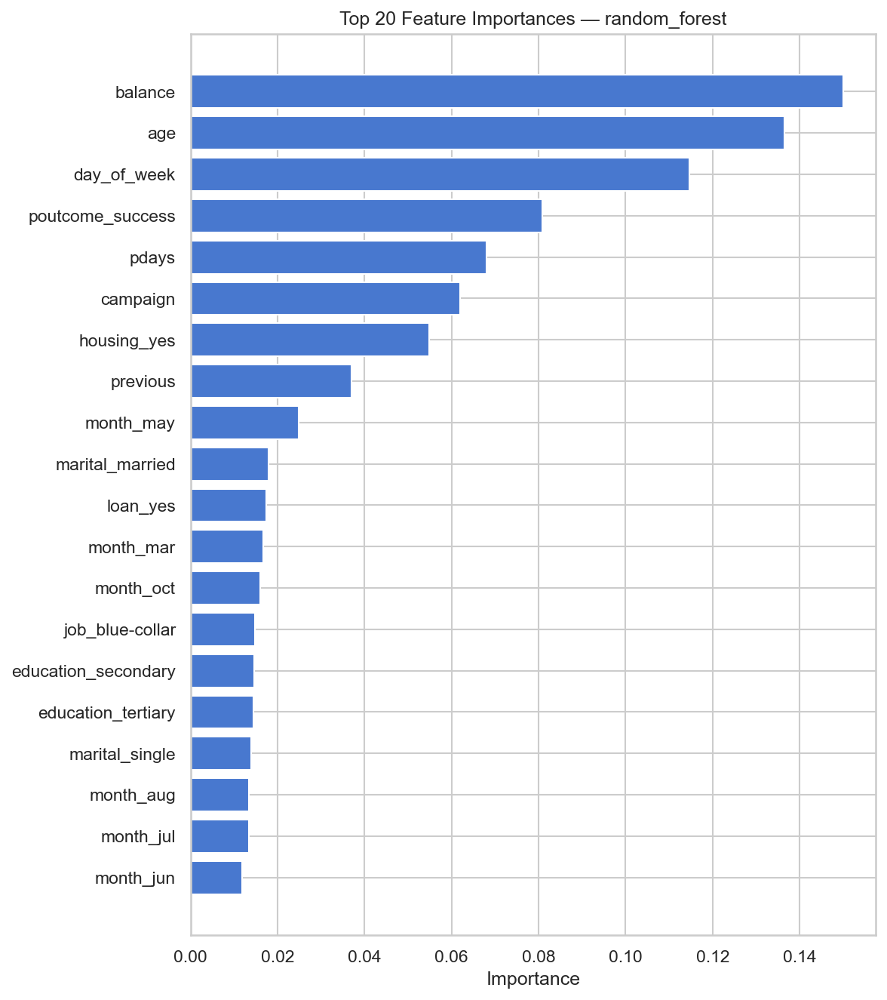
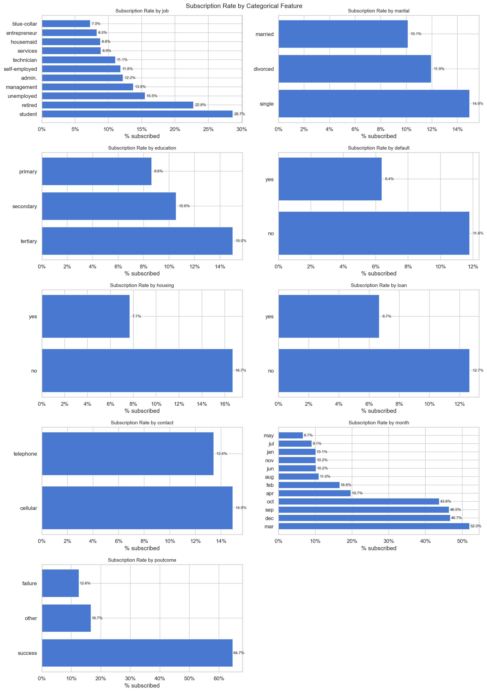

# Bank Marketing — Term Deposit Subscription Predictor

> **ML Classification Project** · University of Toronto Data Sciences Institute · Group 3

---

## Contents

- [Overview](#overview)
- [Business Question & Impact](#business-question--impact)
- [Stakeholders](#stakeholders)
- [Dataset](#dataset)
- [Analytical Approach](#analytical-approach)
- [Key Results](#key-results)
- [Project Structure](#project-structure)
- [Tech Stack](#tech-stack)
- [Quick Start](#quick-start)
- [Pipeline Steps](#pipeline-steps)
- [MLflow Experiment Tracking](#mlflow-experiment-tracking)
- [Key Findings](#key-findings)
- [Dataset Limitations](#dataset-limitations)
- [Ethical Considerations](#ethical-considerations)
- [Reproducing the Results](#reproducing-the-results)
- [Changes from Original Project Plan](#changes-from-original-project-plan)
- [Team Collaboration](#team-collaboration)
- [Team](#team)

---

## Overview

This project builds an end-to-end **binary classification pipeline** to predict whether a bank client will subscribe to a term deposit product. The full pipeline covers automated data ingestion, cleaning, feature engineering, model training with experiment tracking, and evaluation — all containerised and reproducible.

**The core problem:** A Portuguese bank ran 45,211 marketing calls over 2 years (2008–2010). Only **11.7%** of clients subscribed — meaning **88.3% of calls were wasted**. Our model identifies likely subscribers *before* the call is made.

**Best result:** Random Forest achieves **ROC-AUC = 0.80**, delivering a **3.7× improvement** in call success rate and reducing wasted outreach by **86%**.

---

## Business Question & Impact

> **Can we predict whether a client will subscribe to a term deposit, based on demographic, financial, and previous campaign details?**

### Industry Value

Traditional marketing campaigns rely on mass phone outreach — expensive, inefficient, and fatiguing to customers. This project converts raw customer data into a **decision engine** that tells the bank exactly who to call, when, and why. The result: higher conversion rates, lower acquisition costs, reduced customer fatigue, and a measurable increase in campaign ROI.

### Quantified Business Impact

| Scenario | Calls Made | Subscribers Found | Success Rate |
|----------|-----------|-------------------|--------------|
| **Without model** (call everyone) | 6,782 | 793 | 11.7% |
| **With Random Forest** (top flagged) | 952 | 413 | **43.4%** |
| **Improvement** | −86% calls | captures 52% of all subscribers | **3.7× better** |

> Think of the model as a "smart call list" — instead of calling everyone, it ranks clients by likelihood to subscribe. Calling only the top-ranked 952 out of 6,782 still captures over half of all actual subscribers, while eliminating 5,830 wasted calls.

---

## Stakeholders

| Stakeholder | Why They Care | What They Gain |
|-------------|--------------|----------------|
| **Marketing Department** | Responsible for campaign planning and ROI | Target high-probability clients; reduce wasted spend; improve conversion rates |
| **Sales / Call Centre Teams** | Agents interact directly with customers | Higher success rate per call; less time on low-probability leads; better customer interactions |
| **Senior Management / Executives** | Focus on profitability and strategic direction | Increased revenue, lower operational costs, data-driven resource allocation |
| **Data & Analytics Team** | Responsible for model development and maintenance | Reliable, scalable, auditable pipeline with MLflow experiment tracking |
| **Customers** | Indirectly affected by campaign outreach | Fewer irrelevant calls; more personalised, timely offers; improved experience |

---

## Dataset

| Property | Value |
|----------|-------|
| Source | [UCI ML Repository — Bank Marketing (id=222)](https://archive.ics.uci.edu/dataset/222/bank+marketing) |
| Rows | 45,211 client records |
| Features | 16 input features (demographic, financial, campaign) |
| Target | `subscribed` — did the client subscribe? (`yes` → 1 / `no` → 0) |
| Class balance | **11.7% positive** — severely imbalanced |
| Period | May 2008 – November 2010, Portuguese retail bank |

### Class Imbalance



Only 1 in 8.5 clients subscribed. Accuracy alone is misleading — we optimise for **ROC-AUC** and **F1**.

### Feature Groups

| Group | Features |
|-------|----------|
| **Demographic** | `age`, `job`, `marital`, `education` |
| **Financial** | `balance` (avg yearly), `default`, `housing`, `loan` |
| **Last contact** | `contact`, `month`, `day_of_week` |
| **Campaign** | `campaign`, `pdays`, `previous`, `poutcome` |
| **Engineered** | `previously_contacted` — binary flag from `pdays != 999` |
| **Excluded** | `duration` — call length only known *after* the call; excluded to prevent data leakage |

### Data Quality Check

| Check | Result |
|-------|--------|
| Null / NaN values | None — no standard missing values |
| Duplicate rows | None detected |
| Encoded missing values | `"unknown"` strings in categorical columns → replaced with NaN for imputation |
| Class imbalance | ~88% `no` vs ~12% `yes` — significant; accuracy alone is misleading |
| Data leakage | `duration` (call length) known only after the call ends — excluded from all models |

---

## Analytical Approach

The project follows a structured seven-step ML workflow:

| Step | What We Did |
|------|-------------|
| **1. Exploratory Data Analysis** | Distributions, correlations, class imbalance plots, subscription rates by category |
| **2. Data Preprocessing** | Drop `duration` (leakage), replace `"unknown"` with NaN, encode target, engineer `previously_contacted` flag, stratified 70/15/15 split |
| **3. Handle Class Imbalance** | `class_weight='balanced'` for sklearn models; `scale_pos_weight=7` for XGBoost — simpler and less leak-prone than SMOTE |
| **4. Baseline Model** | Logistic Regression establishes a transparent reference (ROC-AUC 0.7719) |
| **5. Model Training** | Random Forest (n=300) and XGBoost trained inside sklearn pipelines with ColumnTransformer preprocessing |
| **6. Evaluation** | ROC-AUC and F1 as primary metrics; confusion matrix, ROC curve, threshold analysis, and predictions saved to PostgreSQL |
| **7. Cross-Validation** | 5-fold stratified CV on training set; final metrics reported on held-out test set |

---

## Key Results

### Model Comparison



| Model | ROC-AUC | F1 | Precision | Recall | Accuracy |
|-------|--------|----|-----------|--------|----------|
| Logistic Regression | 0.7719 | 0.378 | 0.269 | 0.637 | 0.755 |
| **Random Forest** | **0.8036** | **0.471** | **0.432** | **0.517** | **0.864** |
| XGBoost | 0.8022 | 0.463 | 0.381 | 0.590 | 0.840 |

**Winner: Random Forest** — best ROC-AUC and most balanced precision/recall.

### Best Model — ROC Curve & Confusion Matrix

| ROC Curve | Confusion Matrix |
|-----------|-----------------|
|  |  |

Random Forest on the held-out test set (6,782 clients):
- **413 true positives** — subscribers correctly identified
- **539 false positives** — non-subscribers incorrectly flagged
- **380 false negatives** — missed subscribers
- **5,450 true negatives** — non-subscribers correctly dismissed

### What Drives Subscription?



Top drivers:
1. **Account balance** — wealthier clients more likely to invest
2. **Age** — middle-aged and retired clients subscribe most
3. **Previous campaign outcome** — success in prior campaign → 64.7% repeat rate
4. **Campaign contacts** — diminishing returns after 3 contacts
5. **Days since last contact** — recent contacts are warmer leads

### Subscription Rates by Category



---

## Project Structure

```
Bank-Marketing_ML_group3/
├── data/
│   ├── raw/                        # Raw UCI download (gitignored)
│   ├── processed/                  # Cleaned train/val/test Parquet files (gitignored)
│   └── sql/
│       └── schema.sql              # PostgreSQL table definitions (4 tables)
├── docker/
│   └── postgres/
│       └── init.sql                # DB init (creates mlflow DB on first start)
├── experiments/
│   └── notebooks/
│       ├── 01_eda.ipynb            # Exploratory Data Analysis
│       └── 02_model_experiments.ipynb
├── models/                         # Saved model .pkl files (gitignored)
├── reports/
│   ├── figures/                    # All EDA and evaluation plots (PNG)
│   ├── training_summary.csv        # Model metrics comparison
│   ├── classification_report_*.txt # Per-model classification reports
│   └── threshold_analysis_*.csv    # Precision/recall at different thresholds
├── src/
│   ├── config.py                   # Centralised settings (pydantic-settings)
│   ├── data/
│   │   ├── ingest.py               # UCI download → disk → PostgreSQL
│   │   ├── preprocess.py           # Cleaning, encoding, train/val/test split
│   │   └── database.py             # SQLAlchemy PostgreSQL client
│   ├── features/
│   │   └── build_features.py       # sklearn ColumnTransformer pipeline
│   ├── models/
│   │   ├── train.py                # MLflow-tracked training (3 classifiers)
│   │   ├── evaluate.py             # Metrics, confusion matrix, ROC curve, DB write
│   │   └── predict.py              # Inference — load model → predict
│   └── visualization/
│       └── plots.py                # EDA + model comparison charts
├── scripts/
│   ├── run_pipeline.py             # CLI orchestrator (--ingest/--preprocess/--train/--evaluate)
│   ├── run_eda.py                  # Standalone EDA runner
│   └── build_presentation.py       # Generate PPTX presentation
├── README_folder/                  # Per-folder README documentation
├── .env.example                    # Environment variable template
├── .gitignore
├── docker-compose.yml              # PostgreSQL + MLflow + pgAdmin services
├── Dockerfile                      # Multi-stage app container
├── Makefile                        # Convenience targets
└── pyproject.toml                  # uv project config + dependencies
```

See [`README_folder/`](README_folder/) for detailed per-folder documentation.

---

## Tech Stack

| Layer | Tool | Purpose |
|-------|------|---------|
| Language | Python 3.11 | Core language |
| Dependency management | [uv](https://docs.astral.sh/uv/) | Fast, lockfile-based |
| ML | scikit-learn, XGBoost | Model training |
| Experiment tracking | MLflow 3.10 | Run logging, model registry |
| Database | PostgreSQL 16 | Data persistence (4 tables) |
| ORM | SQLAlchemy 2 | DB access layer |
| Visualisation | matplotlib, seaborn, plotly | Charts and figures |
| Containers | Docker + Docker Compose | Reproducible infrastructure |
| Notebooks | Jupyter Lab | EDA and exploration |

### PostgreSQL Tables

| Table | Rows | Contents |
|-------|------|----------|
| `raw_features` | 45,211 | Original UCI dataset as ingested |
| `processed_features` | 45,211 | Cleaned features as JSONB, split labels |
| `experiment_results` | 3 | Per-model metrics, MLflow run IDs, params |
| `predictions` | 20,346 | Test-set predictions for all 3 models |

---

## Quick Start

### Prerequisites

- [uv](https://docs.astral.sh/uv/getting-started/installation/) — Python package manager
- [Docker Desktop](https://www.docker.com/products/docker-desktop/) — for infrastructure
- Python 3.11+

### Step 1 — Install dependencies

```bash
git clone <repo-url>
cd Bank-Marketing_ML_group3
uv sync
cp .env.example .env
```

### Step 2 — Start infrastructure

```bash
docker compose build mlflow        # first time only — bakes pip install into image
docker compose up -d postgres mlflow
# Wait ~30 seconds for MLflow to start
# MLflow UI: http://localhost:5000
# PostgreSQL: localhost:5432
```

### Step 3 — Run the pipeline

```bash
# All steps in sequence:
uv run python -m scripts.run_pipeline --ingest
uv run python -m scripts.run_pipeline --preprocess
uv run python -m scripts.run_pipeline --train
uv run python -m scripts.run_pipeline --evaluate

# Or all at once:
uv run python -m scripts.run_pipeline --all
```

### Step 4 — View results

| Output | Location |
|--------|----------|
| Model metrics | `reports/training_summary.csv` |
| Plots | `reports/figures/*.png` |
| MLflow UI | http://localhost:5000 |
| Postgres predictions | `SELECT * FROM predictions ORDER BY predicted_proba DESC LIMIT 20;` |

---

## Pipeline Steps

```
UCI Repository  (ucimlrepo id=222)
      │
      ▼
[1] INGEST          src/data/ingest.py
    Download 45,211 records → data/raw/bank_marketing_raw.csv
    Load to PostgreSQL raw_features table
      │
      ▼
[2] PREPROCESS      src/data/preprocess.py
    Drop duration (data leakage)
    Replace "unknown" with NaN → imputed later by sklearn
    Encode target: yes→1, no→0
    Engineer previously_contacted flag (pdays != 999)
    Stratified 70/15/15 split → data/processed/*.parquet
    Write to PostgreSQL processed_features table
      │
      ▼
[3] TRAIN           src/models/train.py
    Build sklearn Pipeline (ColumnTransformer + classifier)
    5-fold stratified cross-validation
    Fit 3 models → log metrics/params/artefacts to MLflow
    Register models in MLflow Model Registry
    Save .pkl to models/
    Write to PostgreSQL experiment_results table
      │
      ▼
[4] EVALUATE        src/models/evaluate.py
    Test-set metrics (ROC-AUC, F1, precision, recall, accuracy)
    Confusion matrix + ROC curve plots → reports/figures/
    Threshold analysis CSV → reports/
    Write predictions to PostgreSQL predictions table
```

---

## MLflow Experiment Tracking

Every training run logs automatically:

| What | Details |
|------|---------|
| **Parameters** | Model hyperparameters, random seed, feature flags |
| **CV Metrics** | 5-fold cross-validated ROC-AUC, F1, precision, recall |
| **Val Metrics** | ROC-AUC, F1, precision, recall, accuracy on validation set |
| **Artefacts** | Self-contained sklearn Pipeline `.pkl` |
| **Tags** | Model type, `include_duration` flag |
| **Registry** | `bank_marketing_<model>` — all versions tracked |

Open the MLflow UI: **http://localhost:5000**

---

## Key Findings

1. **Class imbalance is real and important.** Only 11.7% of clients subscribed. Accuracy is misleading — a model predicting "No" always would achieve 88.3% accuracy but find zero subscribers. We optimise ROC-AUC and F1.

2. **Previous campaign success is the strongest signal.** Clients who subscribed in a prior campaign have a 64.7% repeat rate (vs 11.7% baseline). Always re-contact previous subscribers first.

3. **Account balance and age are the top predictors.** Wealthier and middle-aged/retired clients are significantly more likely to invest. Segment marketing lists accordingly.

4. **Contact limits matter.** Success rates drop sharply after 3 contact attempts. A 3-call policy per campaign cycle prevents wasted effort.

5. **Excluding `duration` is essential.** Call duration is only known after the call ends — including it would cause data leakage and a falsely optimistic model useless at deployment time.

6. **Random Forest beats XGBoost narrowly** (AUC 0.8036 vs 0.8022). Both far outperform the logistic regression baseline (AUC 0.7719), validating the value of ensemble methods on this data.

---

## Dataset Limitations

| # | Limitation | Impact |
|---|-----------|--------|
| 1 | **Data leakage — `duration`** | Call duration is known only after the call ends. Including it inflates model accuracy unrealistically. It is dropped before training. |
| 2 | **Class imbalance (~88/12)** | A naive "always predict no" classifier achieves ~88% accuracy. Standard accuracy is misleading — ROC-AUC and F1 are used instead. |
| 3 | **Temporal / macroeconomic confounding** | Data spans May 2008 – November 2010, covering the global financial crisis. Models may not generalise to different economic environments. |
| 4 | **Single institution / country** | Data comes from one Portuguese bank. Results cannot be directly generalised to other banks, countries, or cultures. |
| 5 | **Aggregated contact data** | Multiple calls per campaign are summarised into counts (`campaign`, `pdays`, `previous`). Individual call-level dynamics are lost. |
| 6 | **Age of data** | The dataset is approximately 15 years old. Banking products, customer behaviour, and digital channels have changed substantially since 2008–2010. |

---

## Ethical Considerations

- **Demographic bias:** Age, job, education, and marital status are included as features. The model should be audited for disparate impact across protected groups before any production deployment.
- **Explainability:** Logistic Regression coefficients provide a transparent baseline. SHAP values should be computed for Random Forest/XGBoost before production use.
- **Privacy:** No personally identifiable information (PII) is present. All records are anonymised at source by the UCI repository.
- **Threshold fairness:** Lowering the decision threshold increases recall (contacts more potential subscribers) but increases false positives (wasted calls). The business team must decide the trade-off based on call costs vs. expected revenue — this is not a purely technical decision.
- **Deployment readiness:** Model performance should be re-evaluated on fresh campaign data before deployment, as client behaviour and economic conditions change over time.

---

## Reproducing the Results

Everything needed to recreate the full analysis from scratch:

```bash
# 1. Clone
git clone <repo-url>
cd Bank-Marketing_ML_group3

# 2. Install exact locked dependencies
uv sync

# 3. Configure environment
cp .env.example .env
# Default .env works out of the box with Docker

# 4. Build the MLflow image (first time only — cached afterwards)
docker compose build mlflow

# 5. Start infrastructure
docker compose up -d postgres mlflow

# 6. Run full pipeline
uv run python -m scripts.run_pipeline --all

# 7. View results
# Reports:  reports/figures/  and  reports/training_summary.csv
# MLflow:   http://localhost:5000
# Postgres: psql -h localhost -p 5432 -U postgres -d bank_marketing
```

The `uv.lock` file pins all dependency versions, ensuring reproducible installs across machines.

---

## Changes from Original Project Plan

The following changes were made relative to the initial project plan:

| Change | Reason |
|--------|--------|
| Dataset is **16 features** (bank-full), not 20 (bank-additional-full) | `ucimlrepo id=222` returns the bank-full version; bank-additional-full has different economic indicators |
| MLflow 3.x requires **`--disable-security-middleware`** | MLflow 3.0+ changed networking defaults; needed for Docker port-forwarding |
| MLflow runs from a **pre-built Docker image** (`docker/mlflow/Dockerfile`) | Avoids `pip install` on every startup — eliminates healthcheck timeouts on fresh machines |
| `duration` excluded explicitly | Confirmed as data leakage after reviewing feature definitions |
| Added **4 PostgreSQL tables** | Extended from raw_features only to include processed_features, predictions, experiment_results |
| Class imbalance handled with **`class_weight='balanced'`** | Simpler and less prone to target leakage than SMOTE |

---

## Team Collaboration

Our team followed these practices:

- **Git workflow:** Feature branches with pull requests; each team member created and reviewed PRs
- **Daily standups:** Tracked blockers and progress each session
- **Shared infrastructure:** Docker Compose ensures all team members run identical services
- **Reproducibility first:** `uv.lock` pins all dependencies; `.env.example` documents all configuration
- **MLflow tracking:** All experiments logged centrally so the team can compare runs

---

## Team

| Member | Role | Responsibilities | Video |
|--------|------|-----------------|-------|
| **Morolake Nwokoro** | Data Preparation & Quality Lead | Data ingestion and validation, cleaning and preprocessing, handling missing values, encoding categorical variables, feature scaling, preparing train/test datasets | [Link to video](#) |
| **Anthony Chude** | EDA & Feature Engineering Lead | Exploratory data analysis, identifying patterns and correlations, visualisations, detecting class imbalance, designing new features, providing insights to guide modelling | [Link to video](#) |
| **Greg Ealeifo** | ML Modelling Lead | Implementing baseline and ensemble models, training and tuning, cross-validation, evaluating with precision, recall, F1 and ROC-AUC, selecting the best model | [Link to video](#) |
| **Olga Drobushko** | ML Pipeline & Documentation Lead | End-to-end pipeline implementation, project structure and codebase organisation, MLflow experiment tracking, Git version control, README and final report | [Link to video](#) |

> Each team member will record a 3–5 minute portfolio video.

---